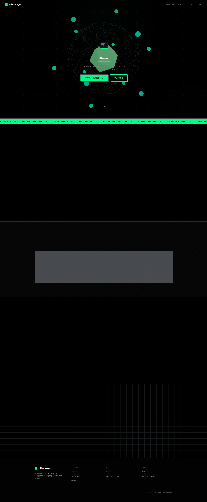

# dMessage

**Escape the surveillance. Own your conversations.**

**Live deployment:** [dmessage.vercel.app](https://dmessage.vercel.app)

## Project Description

dMessage is a decentralized, end-to-end encrypted messaging platform built on the Stellar blockchain — created so you can talk without being listened to, mined, traded, or fed into someone's AI training pipeline.

Big tech companies treat your private conversations as their free data mine. Every message, every contact, every metadata point is scraped, analyzed, and used to train models you'll never control and profits you'll never see. dMessage exists to break that cycle.

Your data is not their product. Your words are not their training set.

Messages are encrypted on your device using X25519 ECDH key exchange + AES-GCM-256 — the same standards militaries and security professionals trust. The encrypted blobs live on IPFS, not on a corporate server. Only cryptographic hashes and metadata touch the Stellar Soroban blockchain, which no single entity controls. No servers to subpoena. No database to breach. No CEO to decide your data is worth more than your privacy.

## Project Vision

A world where:
- Your identity is your wallet — not a login tied to your real name, phone number, or email
- Your messages are private by default — end-to-end encrypted before they leave your device
- Your data stays yours — no one can resell, train on, or monetize your conversations
- Your communication is uncensorable — no intermediary can decide who you're allowed to talk to

## Key Features

- **Stellar Wallet Identity**: Login with Freighter, Albedo, or any Stellar wallet via Wallet Kit
- **End-to-End Encryption**: X25519 ECDH key exchange + AES-GCM-256 symmetric encryption (Web Crypto API)
- **Decentralized Storage**: IPFS for encrypted message content, Soroban for metadata/hashes
- **Real-time Threads**: Live message updates via React Query + Soroban contract queries
- **Media Support**: Text and image sharing with IPFS pinning
- **Wallet Integration**: Native Stellar transaction signing for contract interactions
- **Low Gas Costs**: Optimized Soroban storage patterns using persistent storage
- **Open Source**: Fully auditable smart contracts and frontend code
- **Dark Theme**: Modern UI with Tailwind CSS v4, custom OKLCH color system
- **3D Landing Page**: Interactive hero scene with Three.js and Framer Motion

## Architecture

```
┌─────────────────────┐     ┌──────────────────────┐
│   Next.js Frontend  │     │   IPFS (Content)      │
│   (React 19)        │────▶│   Encrypted blobs     │
│                     │     └──────────────────────┘
│  - Wallet Provider  │
│  - E2EE Crypto      │     ┌──────────────────────┐
│  - React Query      │────▶│   Stellar Soroban    │
│  - Tailwind CSS     │     │   (Metadata/Hashes)  │
└─────────────────────┘     │                      │
                            │  - UserRegistry      │
                            │  - SocialGraph       │
                            │  - MessageContract   │
                            └──────────────────────┘
```

### Smart Contracts

| Contract | Description |
|----------|-------------|
| **UserRegistry** | Stores user profiles: usernames, ECDH public keys, IPFS metadata links |
| **SocialGraph** | Creates deterministic conversation IDs (SHA-256 of sorted addresses), maintains per-user conversation lists |
| **MessageContract** | Stores message hashes with ordering, supports paginated retrieval per conversation |

## Contract Details


### UI Screenshots




**Demo video:** [Watch on Google Drive](https://drive.google.com/file/d/1q4tBQcAu1VbC3sjbPo7HwJt_wO5Mg772/view?usp=sharing)

| Contract | Address | WASM Hash (SHA256) |
|----------|---------|-------------------|
| UserRegistry | `CAQ54Z6ARYWHSGQK4ZWPVLS3SEEDCCRTL4WJLEZAYFPMX4MPA5A77GQO` | `000a21be277fa53e1e91b5cbea85b20d8638dfac07396c157b2894b6f3742964` |
| SocialGraph | `CAIA32SCGTA2UTDWS7TYPSARBT2JJJ7JYR4EZ3ED5K6LNXI2LP645JKD` | `2f1eaee677be5dbd9124a715efb47c432c496681f0145f9e27d3c3153a48401c` |
| MessageContract | `CDJFUACEJEV435V5PEFDYQO6M772VKJ23D3PIJKJPGTYMHKU4NFFODCG` | `0c11a4f44cb48271da223c81b47abdee68fbc9788d1bb3268a0840109523c41d` |

Explorer: [UserRegistry](https://stellar.expert/explorer/testnet/contract/CAQ54Z6ARYWHSGQK4ZWPVLS3SEEDCCRTL4WJLEZAYFPMX4MPA5A77GQO) · [SocialGraph](https://stellar.expert/explorer/testnet/contract/CAIA32SCGTA2UTDWS7TYPSARBT2JJJ7JYR4EZ3ED5K6LNXI2LP645JKD) · [Messages](https://stellar.expert/explorer/testnet/contract/CDJFUACEJEV435V5PEFDYQO6M772VKJ23D3PIJKJPGTYMHKU4NFFODCG)

All contracts were deployed by account [`GDTPJE3COWLAYGDQ4GOGZF64CLHME6HJ5AVDO2ZC44HZXCHJZUXCEPAM`](https://stellar.expert/explorer/testnet/account/GDTPJE3COWLAYGDQ4GOGZF64CLHME6HJ5AVDO2ZC44HZXCHJZUXCEPAM) — view all deployment transactions there.

### Source Verification

Anyone can verify these contracts by rebuilding from source:

```bash
# 1. Clone the repo at the deployment commit
git checkout 3ec3073

# 2. Build
stellar contract build --contract-dir contracts/user_registry
stellar contract build --contract-dir contracts/social_graph
stellar contract build --contract-dir contracts/messages

# 3. Compare SHA256 hashes
sha256sum contracts/target/wasm32v1-none/release/*.wasm
# The output should match the WASM hashes in the table above
```

The deployment manifest with full metadata is at [`deployment.json`](deployment.json).

*Mainnet addresses to be announced post-audit.*

## Getting Started

### Prerequisites
- Node.js 20+
- Rust 1.75+ (with `wasm32-unknown-unknown` target)
- Stellar Freighter browser extension (for wallet connection)

### Setup

```bash
# Clone and install
git clone https://github.com/rylsherdamz-rgb/dMessage.git
cd dMessage

# Install frontend dependencies
cd frontend && npm install && cd ..

# Build smart contracts
cd contracts/user_registry && cargo build --release && cd ../..
cd contracts/social_graph && cargo build --release && cd ../..
cd contracts/messages && cargo build --release && cd ../..
```

### Environment

Copy `.env.example` to `.env.local` and fill in your values:

```bash
cp frontend/.env.example frontend/.env.local
```

Required variables:
- `NEXT_PUBLIC_SOROBAN_RPC` — Soroban RPC endpoint (defaults to Stellar Testnet)
- `NEXT_PUBLIC_CONTRACT_USER_REGISTRY` — Deployed UserRegistry contract ID
- `NEXT_PUBLIC_CONTRACT_SOCIAL_GRAPH` — Deployed SocialGraph contract ID
- `NEXT_PUBLIC_CONTRACT_MESSAGES` — Deployed MessageContract contract ID
- `NEXT_PUBLIC_IPFS_PIN_API` — IPFS pinning service API endpoint

### Run Development Server

```bash
cd frontend && npm run dev
```

Open [http://localhost:3000](http://localhost:3000) in your browser.

## Smart Contract API

### UserRegistry
- `register_user(username, encryption_pubkey, metadata_ipfs)` — Register or update your profile
- `get_user(addr)` — Get a user's profile by their Stellar address

### SocialGraph
- `ensure_conversation(user_a, user_b)` — Create or get a deterministic conversation between two users
- `get_user_conversations(user_addr)` — Get all conversation references for a user

### MessageContract
- `send_message(conversation_id, content_hash, content_type)` — Store a message hash in a conversation
- `get_messages(conversation_id, page, page_size)` — Paginated message retrieval

## Future Scope

- **Group Chats**: Multi-party conversations with shared symmetric keys
- **Verified Identities**: Keybase-style identity proofs via Stellar assets
- **Message Reactions**: Emoji reactions stored as contract events
- **Read Receipts**: Optional delivery and read tracking flags
- **Communities**: Topic-based public channels with membership management
- **Moderation Tools**: User-controlled muting, blocking, and reporting
- **Cross-chain Bridges**: Connect to Ethereum/Solana via Stellar Asset Contracts
- **DAO Governance**: Token-weighted voting for protocol upgrades and parameters
- **Accessibility**: WCAG 2.1 AA compliance with full screen reader support
- **Performance**: IPFS Cluster pinning and CDN gateways for media delivery
- **Mobile**: React Native app with shared crypto/IPFS primitives

## Security

- All smart contracts undergo third-party audit before mainnet deployment
- Client-side E2EE using standards-compliant Web Crypto API (ECDH + AES-GCM)
- Bug bounty program via Immunefi (post-launch)
- Regular dependency updates with Dependabot
- Formal verification of critical contract functions (in progress)

## Tech Stack

| Layer | Technology |
|-------|-----------|
| Blockchain | Stellar Soroban (Rust smart contracts) |
| Frontend | Next.js 16, React 19, TypeScript 5 |
| Styling | Tailwind CSS v4, OKLCH color system |
| 3D Graphics | Three.js, React Three Fiber, Drei |
| Animation | Framer Motion 12 |
| State/Data | TanStack React Query 5 |
| Wallet | Stellar Wallet Kit 2 |
| Crypto | Web Crypto API (ECDH P-256, AES-GCM-256) |
| Storage | IPFS (pinning service + gateway) |
| CI/CD | GitHub Actions (Soroban deploy + Vercel) |

## License

MIT

---

Built with ☯️ on Stellar Soroban
