# dMessage

**Escape the surveillance. Own your conversations.**

**Live deployment:** [dmessage.vercel.app](https://dmessage.vercel.app)
**Launch announcement:** [X/Twitter](https://x.com/ChichiCode0/status/2071606624863858785)
**Promo video:** [`dmessage-promo.mp4`](frontend/public/dmessage-promo.mp4) ([raw](https://raw.githubusercontent.com/rylsherdamz-rgb/dMessage/level5/frontend/public/dmessage-promo.mp4))

## Project Description

dMessage is a decentralized, end-to-end encrypted messaging platform built on the Stellar blockchain — created so you can talk without being listened to, mined, traded, or fed into someone's AI training pipeline.

Big tech companies treat your private conversations as their free data mine. Every message, every contact, every metadata point is scraped, analyzed, and used to train models you'll never control and profits you'll never see. dMessage exists to break that cycle.

Your data is not their product. Your words are not their training set.

Messages are encrypted on your device using X25519 ECDH key exchange + AES-GCM-256 — the same standards militaries and security professionals trust. The encrypted blobs live on IPFS, not on a corporate server. Only cryptographic hashes and metadata touch the Stellar Soroban blockchain, which no single entity controls. No servers to subpoena. No database to breach. No CEO to decide your data is worth more than your privacy.

## Project Vision

A world where:
- Your identity is your wallet — not a login tied to your real name, phone number, or email
- Your messages are private by default — end-to-end encrypted before they leave your device
- Your data stays yours — no one can resell, train on, or monetize your conversations
- Your communication is uncensorable — no intermediary can decide who you're allowed to talk to

## Key Features

- **Stellar Wallet Identity**: Login with Freighter, Albedo, or any Stellar wallet via Wallet Kit
- **End-to-End Encryption**: X25519 ECDH key exchange + AES-GCM-256 symmetric encryption (Web Crypto API)
- **Decentralized Storage**: IPFS for encrypted message content, Soroban for metadata/hashes
- **Real-time Threads**: Live message updates via React Query + Soroban contract queries
- **Media Support**: Text and image sharing with IPFS pinning
- **Wallet Integration**: Native Stellar transaction signing for contract interactions
- **Low Gas Costs**: Optimized Soroban storage patterns using persistent storage
- **Open Source**: Fully auditable smart contracts and frontend code
- **Dark Theme**: Modern UI with Tailwind CSS v4, custom OKLCH color system
- **3D Landing Page**: Interactive hero scene with Three.js and Framer Motion

## Tech Stack

| Layer | Technology |
|-------|-----------|
| Blockchain | Stellar Soroban (Rust smart contracts) |
| Frontend | Next.js 16, React 19, TypeScript 5 |
| Styling | Tailwind CSS v4, OKLCH color system |
| 3D Graphics | Three.js, React Three Fiber, Drei |
| Animation | Framer Motion 12 |
| State/Data | TanStack React Query 5 |
| Wallet | Stellar Wallet Kit 2 |
| Crypto | Web Crypto API (ECDH P-256, AES-GCM-256) |
| Storage | IPFS (pinning service + gateway) |
| CI/CD | GitHub Actions (Soroban deploy + Vercel) |

## Architecture

```
┌─────────────────────┐     ┌──────────────────────┐
│   Next.js Frontend  │     │   IPFS (Content)      │
│   (React 19)        │────▶│   Encrypted blobs     │
│                     │     └──────────────────────┘
│  - Wallet Provider  │
│  - E2EE Crypto      │     ┌──────────────────────┐
│  - React Query      │────▶│   Stellar Soroban    │
│  - Tailwind CSS     │     │   (Metadata/Hashes)  │
└─────────────────────┘     │                      │
                            │  - UserRegistry      │
                            │  - SocialGraph       │
                            │  - MessageContract   │
                            └──────────────────────┘
```

### Smart Contracts

| Contract | Description |
|----------|-------------|
| **UserRegistry** | Stores user profiles: usernames, ECDH public keys, IPFS metadata links |
| **SocialGraph** | Creates deterministic conversation references, maintains per-user conversation lists |
| **MessageContract** | Inbox-per-recipient message storage with paginated retrieval and read receipts |

### Contract Flow

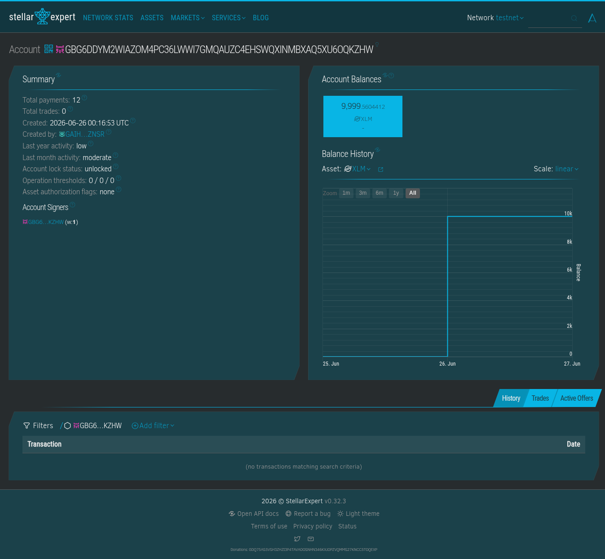
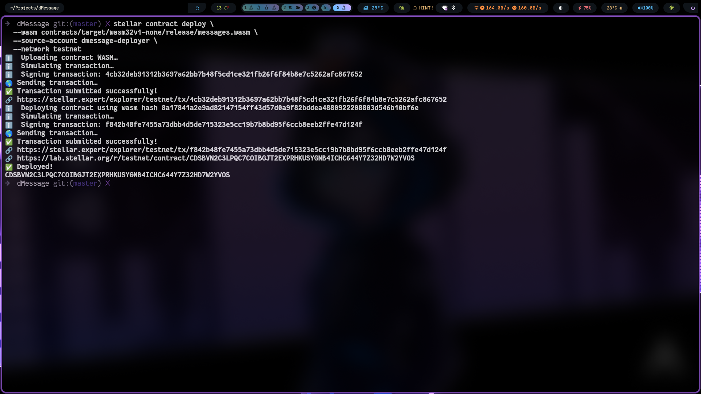
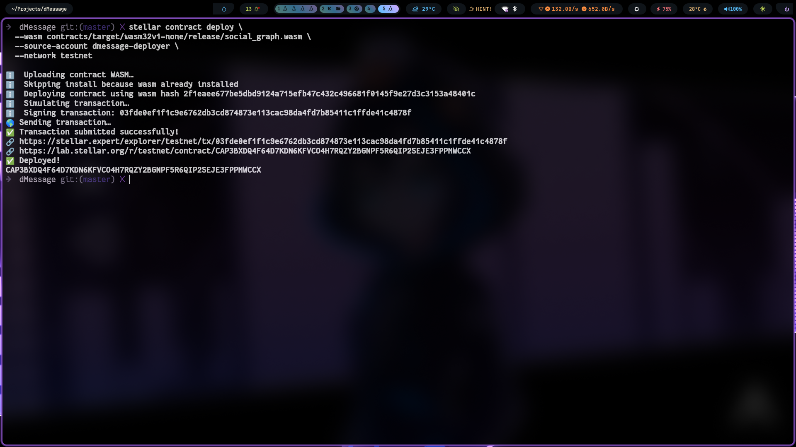
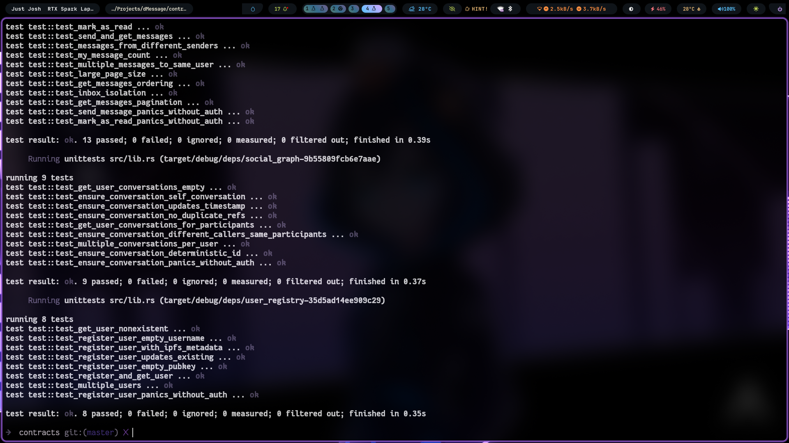
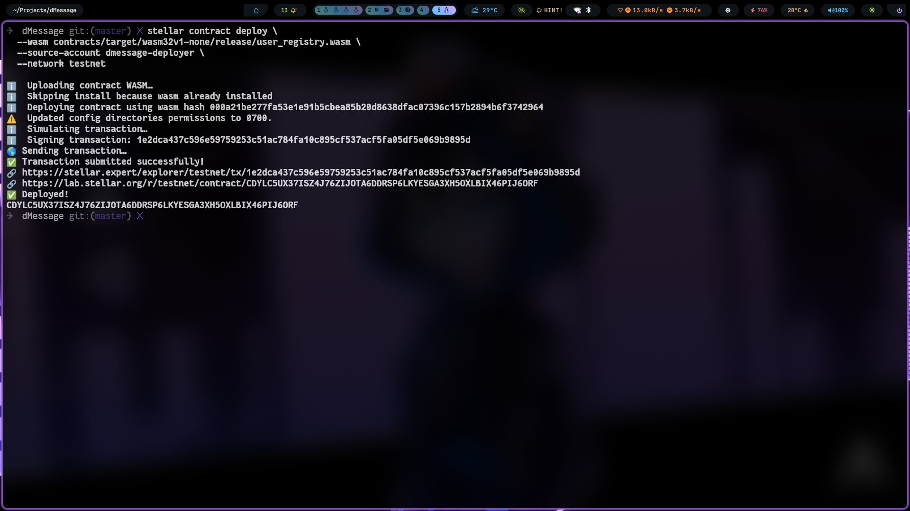

## Smart Contract API

### UserRegistry
- `register_user(username, encryption_pubkey, metadata_ipfs)` — Register or update your profile
- `get_user(addr)` — Get a user's profile by their Stellar address

### SocialGraph
- `ensure_conversation(user_a, user_b)` — Create or get a deterministic conversation between two users
- `get_user_conversations(user_addr)` — Get all conversation references for a user

Users registered and interacting via the deployed Soroban contracts on testnet:

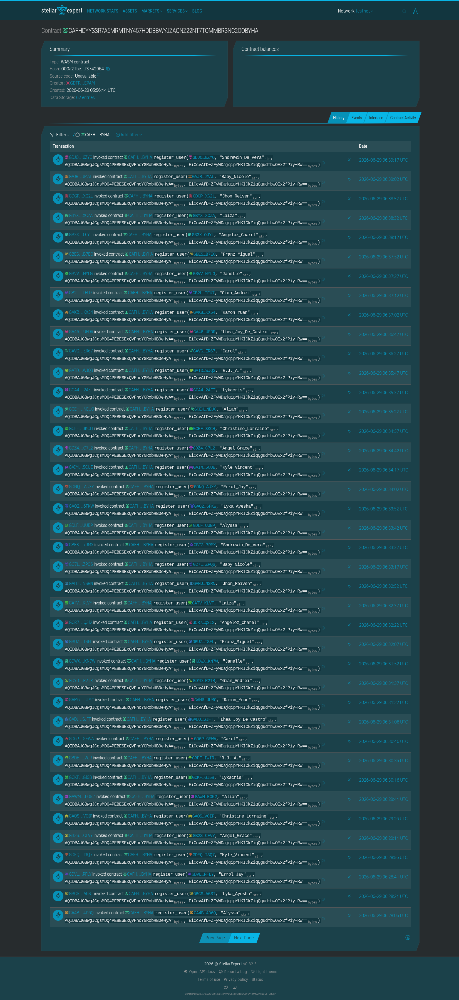
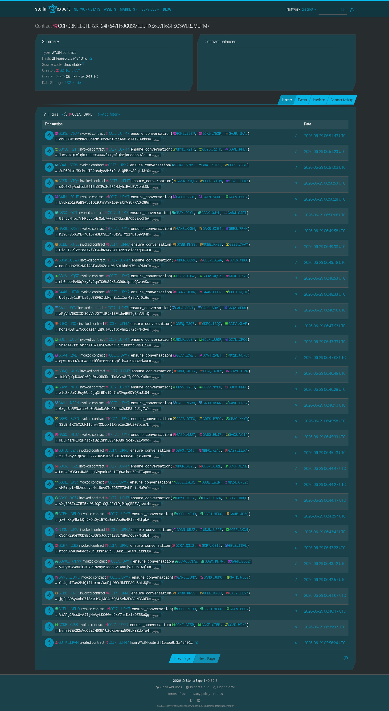
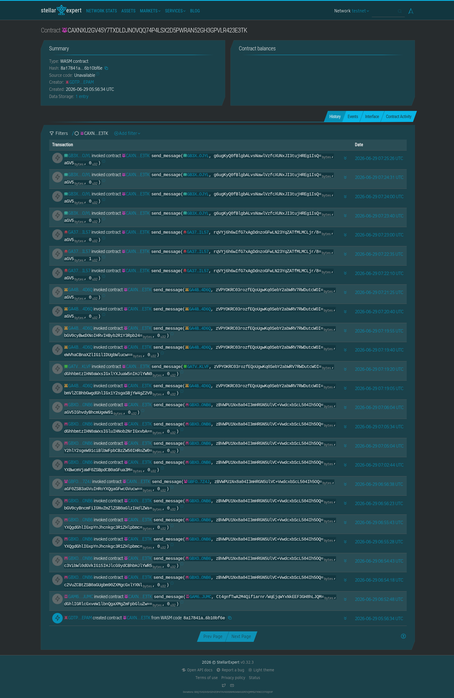

### Vercel Analytics

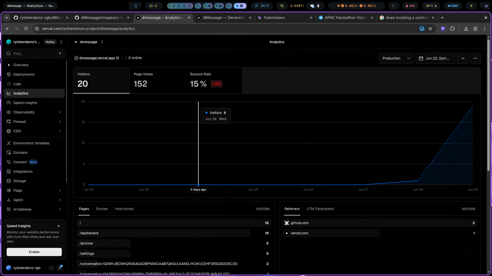

- **User Feedback Folder:** `user_feedback/` ([Excel export](user_feedback/dMessage%20FeedBack%20%28Responses%29.xlsx))

**Demo video:** [`dmessage-promo.mp4`](frontend/public/dmessage-promo.mp4) — [Watch on Google Drive (backup)](https://drive.google.com/file/d/1q4tBQcAu1VbC3sjbPo7HwJt_wO5Mg772/view?usp=sharing)

## User Feedback Iteration Summary

We collected structured feedback from real testers (see `user_feedback/`) and shipped a round of changes based on the most-requested items. The table below maps recurring feedback to what was actually changed in the codebase.

| # | What users asked for | What we changed | Status |
|---|----------------------|-----------------|--------|
| 1 | Dark mode toggle for late-night use | Added a Light/Dark theme toggle in **Settings → Appearance**; replaced hardcoded `text-white` styles with the themeable `--text` CSS variable across the dashboard, settings, and conversation sidebar so text stays readable in both modes | ✅ Shipped |
| 2 | QR codes for sharing wallet addresses | Added a new `QrCode` component (`frontend/src/components/ui/QrCode.tsx`, backed by the `qrcode` package) and surfaced it in **Settings → Account → Share your address** | ✅ Shipped |
| 3 | Search / filter for conversations | Added a conversation filter in the sidebar with a `⌘K` keyboard shortcut | ✅ Shipped |
| 4 | Read receipts / delivery indicators | Added ✓ (delivered) and ✓✓ (read) status indicators backed by the on-chain `mark_as_read` receipt | ✅ Shipped |
| 5 | Emoji picker in chat | Added an emoji picker to the message composer | ✅ Shipped |
| 6 | File sharing beyond text | Added image/file attachments uploaded to IPFS with only the CID sent on-chain (Messenger-style attachment chip UX) | ✅ Shipped |
| 7 | Keyboard shortcuts for power users | Added shortcuts (e.g. `⌘K` to filter conversations) | ✅ Shipped |
| 8 | Better mobile experience | Improved mobile responsiveness across the dashboard and sidebar layouts | ✅ Shipped |
| 9 | Notification sound variety, group chats, disappearing messages | Tracked on the roadmap (see [Future Scope](#future-scope)) | 🔜 Planned |
| 10 | Clearer onboarding / empty states | Improved the dashboard welcome/empty state and added an in-README User Guide; richer interactive onboarding tracked for a future iteration | ◑ Partial |

### Documentation updates in this iteration

- Added a full **Technical Documentation** section (cryptographic protocol, smart-contract architecture, frontend architecture, project structure)
- Added a **User Guide** (getting started, features, troubleshooting)
- Added **Community & Contributions** guidelines
- Added the launch announcement and embedded promo video links
- Pointed the promo video raw link at the `level5` branch

### Presentation

View the dMessage pitch deck:

- **Interactive:** [Gamma Presentation](https://gamma.app/docs/dMessage-dq4tl7fbm2p9cxk?mode=doc)
- **PDF:** [`ppt/dMessage.pdf`](ppt/dMessage.pdf)

| Contract | Address | WASM Hash (SHA256) |
|----------|---------|-------------------|
| UserRegistry | `CAFHDYYSSR7A5MRMTNY457HDDBBWYJZAQNZ22NT7TOMMBRSNC2OOBYHA` | `000a21be277fa53e1e91b5cbea85b20d8638dfac07396c157b2894b6f3742964` |
| SocialGraph | `CCI7DBNILBDTLR2KF24I7647H5JGUSMEJDHXS6D7H6GPSQ3WEBJMUPM7` | `2f1eaee677be5dbd9124a715efb47c432c496681f0145f9e27d3c3153a48401c` |
| MessageContract (v2 — current) | `CATLF3WXUG3GMD2J4XIOIYVE3ND7PBFYYXHPS4632ZXEPJPNGYNAEZK7` | `98221de14f435ac68060c3e7494da96819563467ed46ce78ce8d1e618e1bb51d` |
| MessageContract (v1 — deprecated) | `CAXNXU2GV45Y7TXDLDJNOVQQ74P4LSX2D5PWRAN52GH3GPVLR423E3TK` | `8a17841a2e9ad82147154ff43d57d0a9f82bddea4880922208803d546b10bf6e` |

Explorer: [UserRegistry](https://stellar.expert/explorer/testnet/contract/CAFHDYYSSR7A5MRMTNY457HDDBBWYJZAQNZ22NT7TOMMBRSNC2OOBYHA) · [SocialGraph](https://stellar.expert/explorer/testnet/contract/CCI7DBNILBDTLR2KF24I7647H5JGUSMEJDHXS6D7H6GPSQ3WEBJMUPM7) · [Messages v2](https://stellar.expert/explorer/testnet/contract/CATLF3WXUG3GMD2J4XIOIYVE3ND7PBFYYXHPS4632ZXEPJPNGYNAEZK7) · [Messages v1 (deprecated)](https://stellar.expert/explorer/testnet/contract/CAXNXU2GV45Y7TXDLDJNOVQQ74P4LSX2D5PWRAN52GH3GPVLR423E3TK)

All contracts were deployed by account [`GDTPJE3COWLAYGDQ4GOGZF64CLHME6HJ5AVDO2ZC44HZXCHJZUXCEPAM`](https://stellar.expert/explorer/testnet/account/GDTPJE3COWLAYGDQ4GOGZF64CLHME6HJ5AVDO2ZC44HZXCHJZUXCEPAM) (v1) and [`GDHP5PPKFRCC23E6MSNDKC7UCHYNTV74DJI7UYR7EDR4YMSGCL3KTZQH`](https://stellar.expert/explorer/testnet/account/GDHP5PPKFRCC23E6MSNDKC7UCHYNTV74DJI7UYR7EDR4YMSGCL3KTZQH) (v2) — view all deployment transactions there.

### Source Verification

Anyone can verify these contracts by rebuilding from source:

```bash
# 1. Clone the repo at the deployment commit
git checkout 3ec3073

# 2. Build
stellar contract build --contract-dir contracts/user_registry
stellar contract build --contract-dir contracts/social_graph
stellar contract build --contract-dir contracts/messages

# 3. Compare SHA256 hashes
sha256sum contracts/target/wasm32v1-none/release/*.wasm
# The output should match the WASM hashes in the table above
```

The deployment manifest with full metadata is at [`deployment.json`](deployment.json).

*Mainnet addresses to be announced post-audit.*
### MessageContract
- `send_message(conversation_id, content_hash, content_type)` — Store a message hash in a conversation
- `get_messages(conversation_id, page, page_size)` — Paginated message retrieval

## Getting Started

### Prerequisites
- Node.js 20+
- Rust 1.75+ (with `wasm32-unknown-unknown` target)
- Stellar Freighter browser extension (for wallet connection)

### Setup

```bash
# Clone and install
git clone https://github.com/rylsherdamz-rgb/dMessage.git
cd dMessage

# Install frontend dependencies
cd frontend && npm install && cd ..

# Build smart contracts
cd contracts/user_registry && cargo build --release && cd ../..
cd contracts/social_graph && cargo build --release && cd ../..
cd contracts/messages && cargo build --release && cd ../..
```

### Environment

Copy `.env.example` to `.env.local` and fill in your values:

```bash
cp frontend/.env.example frontend/.env.local
```

Required variables:
- `NEXT_PUBLIC_SOROBAN_RPC` — Soroban RPC endpoint (defaults to Stellar Testnet)
- `NEXT_PUBLIC_CONTRACT_USER_REGISTRY` — Deployed UserRegistry contract ID
- `NEXT_PUBLIC_CONTRACT_SOCIAL_GRAPH` — Deployed SocialGraph contract ID
- `NEXT_PUBLIC_CONTRACT_MESSAGES` — Deployed MessageContract contract ID
- `NEXT_PUBLIC_IPFS_PIN_API` — IPFS pinning service API endpoint

### Run Development Server

```bash
cd frontend && npm run dev
```

Open [http://localhost:3000](http://localhost:3000) in your browser.

## UI Screenshots

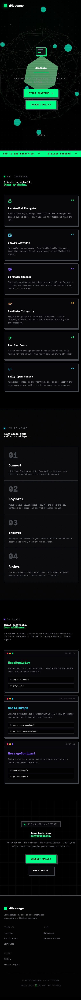
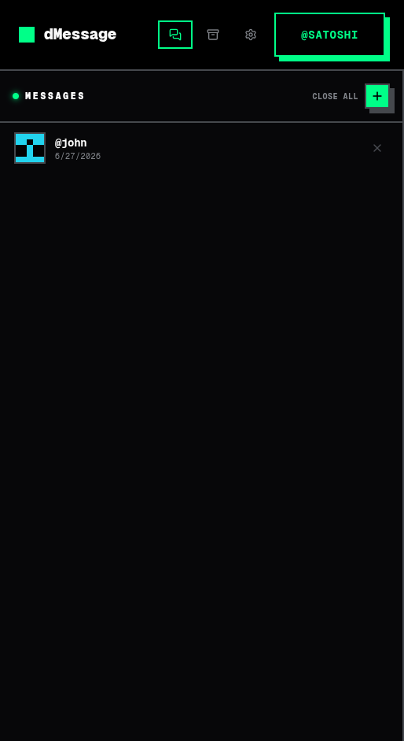
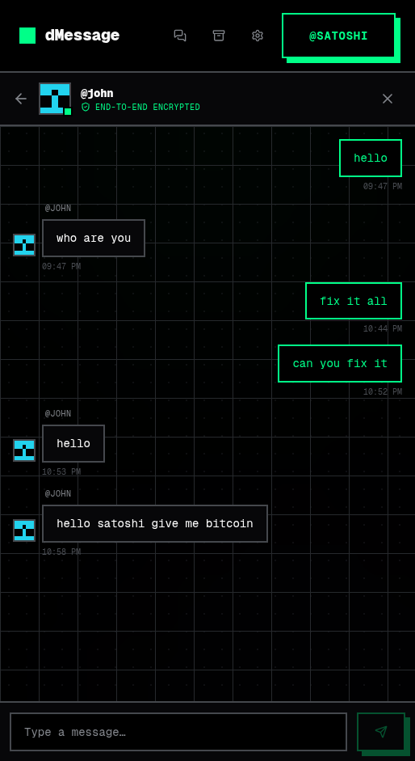
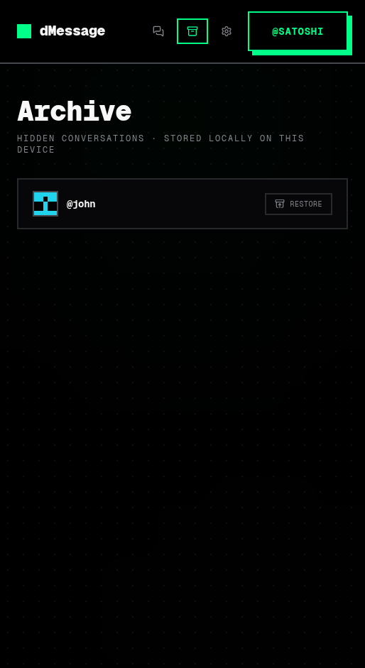
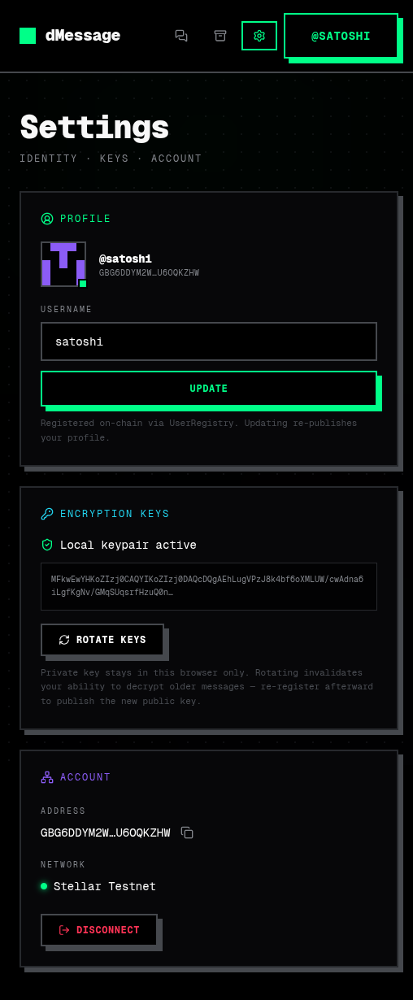
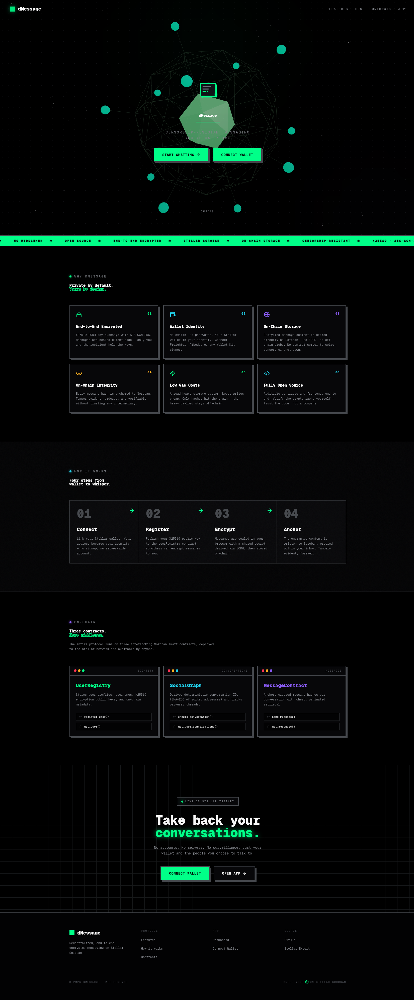
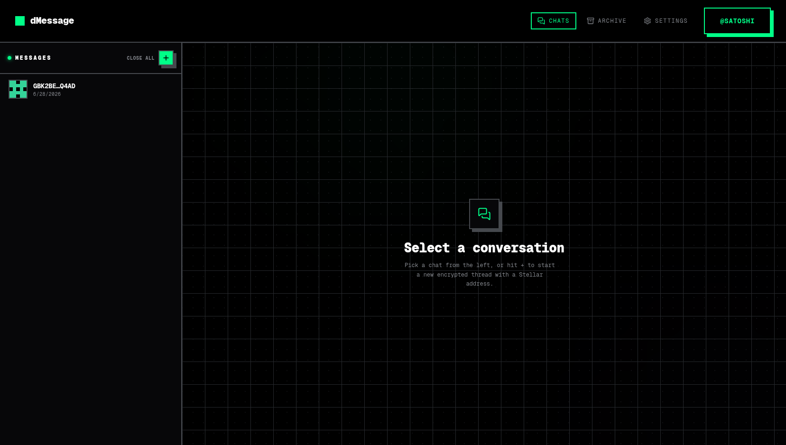
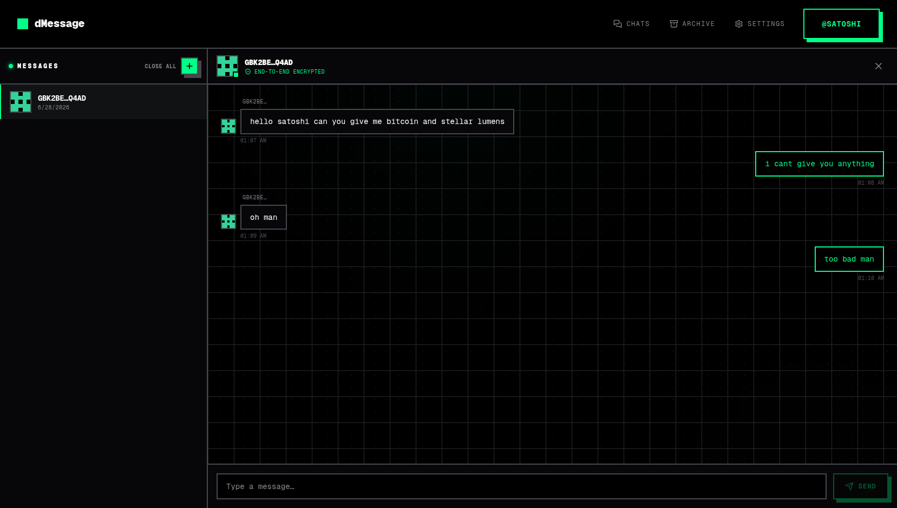
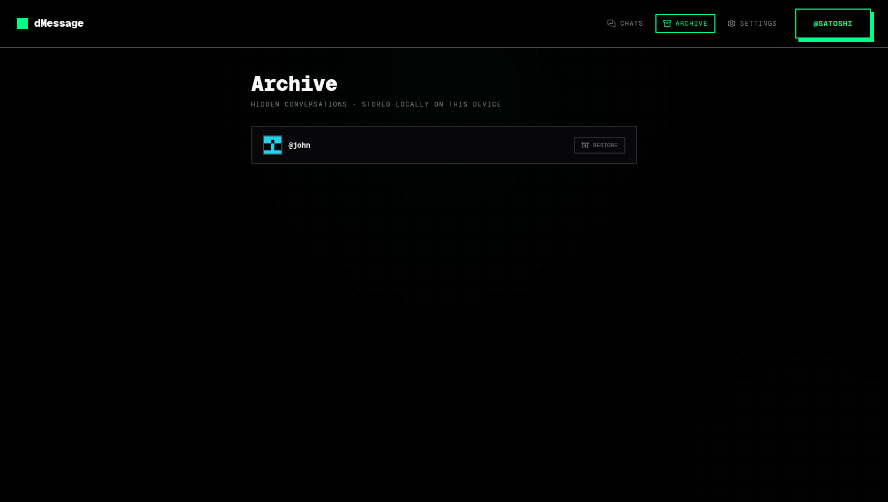
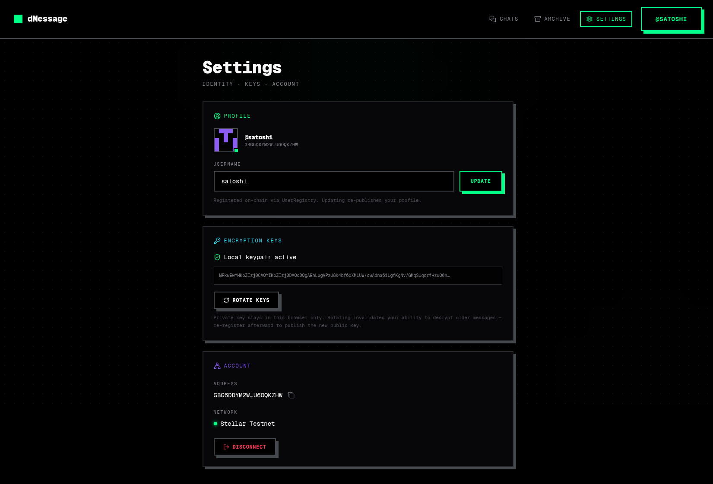

### Proof of Users — On-Chain Activity

### MessageContract
- `send_message(sender, recipient, content)` — Store a message in the recipient's inbox
- `get_messages(user, page, page_size)` — Paginated inbox retrieval
- `mark_as_read(caller, index)` — Mark a message as read
- `my_message_count(user)` — Get the total message count for a user
Users registered and interacting via the deployed Soroban contracts on testnet:


### Vercel Analytics


### User Feedback

dMessage was user-tested with 20 participants who provided feedback via Google Form. The raw responses and a summary of requested changes are linked below.

| Resource | Link |
|----------|------|
| Feedback Form (submit) | [Google Form](https://docs.google.com/forms/d/e/1FAIpQLSc7hyuuQ1cFdldSA9DytbcR9kwo9EXT2DLPiszzqrrfrfwKVQ/viewform) |
| Response Spreadsheet | [Google Sheets](https://docs.google.com/spreadsheets/d/1Mif_PoLEXyziO1vClWaE9RXGxwJ5rDX-RVXyJ128YbA/edit?resourcekey=&gid=213717360#gid=213717360) |

**Top requested improvements (ordered by frequency):**

1. **QR code integration** — scanner for wallet addresses, shareable QR per profile/chat
2. **Onboarding improvements** — guided tour, better first-run experience, feature highlights
3. **Search** — filter conversations and contacts
4. **Dark mode** — theme toggle for night-time use
5. **Read receipts** — delivery indicators and read status on messages
6. **Notification customization** — per-contact sounds, more variety
7. **Group chats** — multi-party encrypted conversations
8. **Emoji picker** — inline emoji selection while typing
9. **File sharing** — send images and files beyond text
10. **Disappearing messages** — auto-delete after viewing

Full details available in the [response spreadsheet](https://docs.google.com/spreadsheets/d/1Mif_PoLEXyziO1vClWaE9RXGxwJ5rDX-RVXyJ128YbA/edit?resourcekey=&gid=213717360#gid=213717360).

- **User Feedback Folder:** `user_feedback/` ([Excel export](user_feedback/dMessage%20FeedBack%20%28Responses%29.xlsx))

**Demo video:** [Watch on Google Drive](https://drive.google.com/file/d/1q4tBQcAu1VbC3sjbPo7HwJt_wO5Mg772/view?usp=sharing)

## Contract Deployment

| Contract | Address | WASM Hash (SHA256) |
|----------|---------|-------------------|
| UserRegistry | `CAFHDYYSSR7A5MRMTNY457HDDBBWYJZAQNZ22NT7TOMMBRSNC2OOBYHA` | `000a21be277fa53e1e91b5cbea85b20d8638dfac07396c157b2894b6f3742964` |
| SocialGraph | `CCI7DBNILBDTLR2KF24I7647H5JGUSMEJDHXS6D7H6GPSQ3WEBJMUPM7` | `2f1eaee677be5dbd9124a715efb47c432c496681f0145f9e27d3c3153a48401c` |
| MessageContract | `CAXNXU2GV45Y7TXDLDJNOVQQ74P4LSX2D5PWRAN52GH3GPVLR423E3TK` | `8a17841a2e9ad82147154ff43d57d0a9f82bddea4880922208803d546b10bf6e` |

Explorer: [UserRegistry](https://stellar.expert/explorer/testnet/contract/CAFHDYYSSR7A5MRMTNY457HDDBBWYJZAQNZ22NT7TOMMBRSNC2OOBYHA) · [SocialGraph](https://stellar.expert/explorer/testnet/contract/CCI7DBNILBDTLR2KF24I7647H5JGUSMEJDHXS6D7H6GPSQ3WEBJMUPM7) · [Messages](https://stellar.expert/explorer/testnet/contract/CAXNXU2GV45Y7TXDLDJNOVQQ74P4LSX2D5PWRAN52GH3GPVLR423E3TK)

All contracts were deployed by account [`GDTPJE3COWLAYGDQ4GOGZF64CLHME6HJ5AVDO2ZC44HZXCHJZUXCEPAM`](https://stellar.expert/explorer/testnet/account/GDTPJE3COWLAYGDQ4GOGZF64CLHME6HJ5AVDO2ZC44HZXCHJZUXCEPAM) — view all deployment transactions there.

### Source Verification

Anyone can verify these contracts by rebuilding from source:

```bash
# 1. Clone the repo at the deployment commit
git checkout 3ec3073

# 2. Build
stellar contract build --contract-dir contracts/user_registry
stellar contract build --contract-dir contracts/social_graph
stellar contract build --contract-dir contracts/messages

# 3. Compare SHA256 hashes
sha256sum contracts/target/wasm32v1-none/release/*.wasm
# The output should match the WASM hashes in the table above
```

The deployment manifest with full metadata is at [`deployment.json`](deployment.json).

*Mainnet addresses to be announced post-audit.*

## Security

- All smart contracts undergo third-party audit before mainnet deployment
- Client-side E2EE using standards-compliant Web Crypto API (ECDH + AES-GCM)
- Bug bounty program via Immunefi (post-launch)
- Regular dependency updates with Dependabot
- Formal verification of critical contract functions (in progress)

## Future Scope

- **Group Chats**: Multi-party conversations with shared symmetric keys
- **Verified Identities**: Keybase-style identity proofs via Stellar assets
- **Message Reactions**: Emoji reactions stored as contract events
- **Read Receipts**: Optional delivery and read tracking flags
- **Communities**: Topic-based public channels with membership management
- **Moderation Tools**: User-controlled muting, blocking, and reporting
- **Cross-chain Bridges**: Connect to Ethereum/Solana via Stellar Asset Contracts
- **DAO Governance**: Token-weighted voting for protocol upgrades and parameters
- **Accessibility**: WCAG 2.1 AA compliance with full screen reader support
- **Performance**: IPFS Cluster pinning and CDN gateways for media delivery
- **Mobile**: React Native app with shared crypto/IPFS primitives

## Security

- All smart contracts undergo third-party audit before mainnet deployment
- Client-side E2EE using standards-compliant Web Crypto API (ECDH + AES-GCM)
- Bug bounty program via Immunefi (post-launch)
- Regular dependency updates with Dependabot
- Formal verification of critical contract functions (in progress)

## Tech Stack

| Layer | Technology |
|-------|-----------|
| Blockchain | Stellar Soroban (Rust smart contracts) |
| Frontend | Next.js 16, React 19, TypeScript 5 |
| Styling | Tailwind CSS v4, OKLCH color system |
| 3D Graphics | Three.js, React Three Fiber, Drei |
| Animation | Framer Motion 12 |
| State/Data | TanStack React Query 5 |
| Wallet | Stellar Wallet Kit 2 |
| Crypto | Web Crypto API (ECDH P-256, AES-GCM-256) |
| Storage | IPFS (pinning service + gateway) |
| CI/CD | GitHub Actions (Soroban deploy + Vercel) |

## Technical Documentation

### Cryptographic Protocol

dMessage uses a hybrid E2EE scheme combining X25519 ECDH key exchange with AES-GCM-256 symmetric encryption:

1. **Key Generation**: Each user generates an X25519 keypair stored in their browser's `localStorage` (never leaked to the network).
2. **Key Registration**: The public key is published on-chain via the `UserRegistry` contract during registration.
3. **Session Key Derivation**: When Alice messages Bob, her client fetches Bob's public key from the contract and computes a shared secret via `ECDH(Alice_priv, Bob_pub)`. This shared secret is fed through HKDF to derive a 256-bit AES key.
4. **Encryption**: The plaintext message is encrypted with AES-GCM-256 using a random 12-byte IV. The IV + ciphertext form the encrypted payload.
5. **Storage**: The encrypted payload is uploaded to IPFS as a JSON blob. Only the IPFS content hash (CID) is sent to the Soroban contract, keeping message content off-chain.

### Smart Contract Architecture

The system uses three Soroban contracts:

- **UserRegistry** (`contracts/user_registry/src/lib.rs`): Maps Stellar addresses to usernames, ECDH public keys, and IPFS metadata links. Implements `register_user` and `get_user` with persistent bumpable storage.

- **SocialGraph** (`contracts/social_graph/src/lib.rs`): Tracks user conversation lists. `ensure_conversation` creates a sorted, deterministic conversation reference between two users. `get_user_conversations` returns paginated results.

- **MessageContract** (`contracts/messages/src/lib.rs`): Per-recipient inbox model. Each message stores `(sender, content_cid, timestamp, read)` in a `Vec` mapped to the recipient's address. Supports paginated reads, read receipts, and message counting.

### Frontend Architecture

- **Wallet Integration**: `WalletProvider` wraps the app, connecting via Stellar Wallet Kit. Supports Freighter, Albedo, and Wallet Connect.
- **Key Management**: `keystore.ts` handles X25519 key generation (via `@noble/curves`), storage, and retrieval.
- **Encryption Pipeline**: `crypto.ts` provides `encryptMessage` and `decryptMessage` using Web Crypto API.
- **Data Fetching**: React Query manages contract state with configurable polling intervals for real-time updates.
- **IPFS Layer**: `ipfs.ts` uploads encrypted payloads to Pinata and fetches them via public gateways.

### Project Structure

```
dMessage/
├── contracts/           # Soroban smart contracts (Rust)
│   ├── user_registry/   # Profile & key management
│   ├── social_graph/    # Conversation indexing
│   └── messages/        # Inbox message storage
├── frontend/            # Next.js 16 application
│   └── src/
│       ├── app/         # Pages & routing
│       ├── components/  # React components
│       ├── hooks/       # React Query hooks
│       └── lib/         # Crypto, IPFS, Stellar utils
├── ppt/                 # Pitch deck materials
├── user_feedback/       # Collected user feedback data
└── images/              # Screenshots & diagrams
```

## User Guide

### Getting Started

1. **Install Freighter**: Download the [Freighter](https://freighter.app) browser extension and create a Stellar wallet. Switch the network to **Testnet** in Freighter settings.

2. **Get Test XLM**: Visit the [Stellar Lab Friendbot](https://laboratory.stellar.org/#account-creator?network=test) and fund your wallet address with testnet lumens.

3. **Connect**: Go to [dmessage.vercel.app](https://dmessage.vercel.app) and click **Connect Wallet**. Approve the connection in Freighter.

4. **Create Your Profile**:
   - Choose a username (letters, numbers, underscores — not just digits)
   - Your encryption keypair is generated automatically in your browser
   - Sign the registration transaction via Freighter when prompted

5. **Start a Conversation**:
   - Copy another user's Stellar address (you can find yours in **Settings → Account → Address**)
   - Paste it into the search bar in the sidebar
   - Click the conversation to open it
   - Type your message and hit send

### Features

- **Dark/Light Mode**: Toggle in **Settings → Appearance**.
- **QR Code**: In **Settings → Account**, click the QR code to share your address.
- **Read Receipts**: Messages show ✓ (delivered) and ✓✓ (read) indicators.
- **Encryption Keys**: Manage your keypair in **Settings → Encryption Keys**. Rotate keys if needed, then re-register to publish the new public key.
- **Network Status**: Your connection to Stellar Testnet is shown in **Settings → Account**.

### Troubleshooting

| Issue | Solution |
|-------|----------|
| Wallet won't connect | Ensure Freighter is on Testnet and funded |
| Messages not sending | Check your encryption keypair in Settings |
| Blank/white screen | Reload the page; clear browser cache if persistent |
| Transaction fails | Ensure you have enough test XLM (use the friendbot) |

## Community & Contributions

We welcome contributions of all kinds — code, design, documentation, testing, and feedback.

### How to Contribute

1. **Fork the repository** on GitHub
2. **Create a feature branch**: `git checkout -b feat/your-feature`
3. **Commit your changes**: `git commit -am 'Add awesome feature'`
4. **Push to the branch**: `git push origin feat/your-feature`
5. **Open a Pull Request** with a clear description of your changes

### Development Setup

See the [Getting Started](#getting-started) section above. After setup, run the test suite:

```bash
cd frontend && npm run build
```

Smart contract tests:

```bash
cd contracts && cargo test
```

### Code Guidelines

- Follow the existing code style (ESLint + Prettier configs are in `frontend/`)
- Smart contracts should use Soroban SDK patterns from the existing contracts
- All new features should include tests (Playwright for frontend, Rust tests for contracts)
- Write meaningful commit messages in the conventional format (`feat:`, `fix:`, `docs:`)

### Reporting Issues

- **Bug reports**: Open a [GitHub Issue](https://github.com/rylsherdamz-rgb/dMessage/issues) with steps to reproduce
- **Security vulnerabilities**: Email the maintainers directly (see security policy)
- **Feature requests**: Use the [Discussions](https://github.com/rylsherdamz-rgb/dMessage/discussions) tab

### Community

- **GitHub Discussions**: [Join the conversation](https://github.com/rylsherdamz-rgb/dMessage/discussions)
- **Twitter/X**: [Launch announcement](https://x.com/ChichiCode0/status/2071606624863858785?s=20)
- **Discord**: [Join our server](https://discord.gg/dmessage) *(coming soon)*

### License
## License

MIT

---

Built with ☯️ on Stellar Soroban
